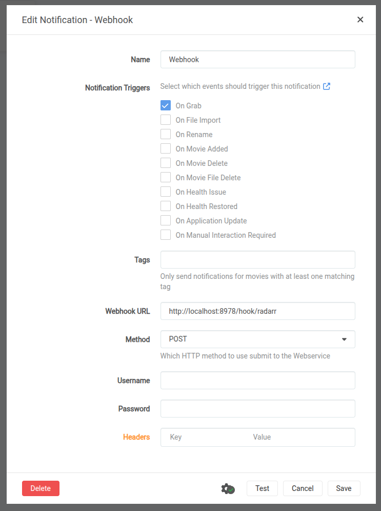

# guardarr

simple app for blocking unwanted/malicious files in servarr stack (with transmission client)

- pull repo
- edit app.py allowed files
- build
- push to your repo
- integrate with servarr stack
- setup sonarr/radarr webhook

- enjoy

### example compose
```
guardarr:
  image: ${REPOSITORY}/guardarr:latest
  container_name: guardarr
  network_mode: "service:gluetun"
  depends_on:
    - gluetun
  restart: unless-stopped
  environment:
    - TZ=${TIMEZONE}
    - SONARR_URL=http://localhost:8989
    - SONARR_API_KEY=${SONARR_API_KEY}
    - RADARR_URL=http://localhost:7878
    - RADARR_API_KEY=${RADARR_API_KEY}
    - TRANSMISSION_URL=http://localhost:9091/transmission/rpc
    - TRANSMISSION_USER=${TRANSMISSION_USER}
    - TRANSMISSION_PASS=${TRANSMISSION_PASSWORD}
    - WEBHOOK_PORT=8978
```